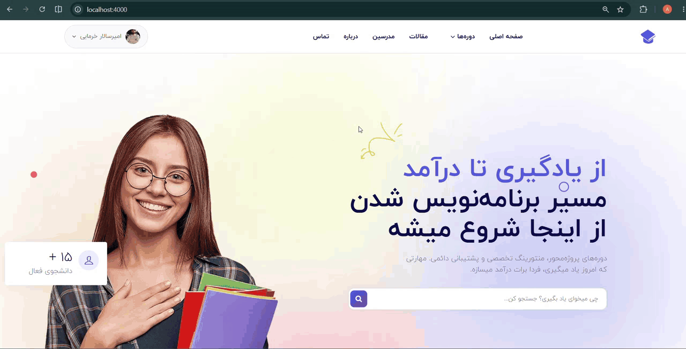
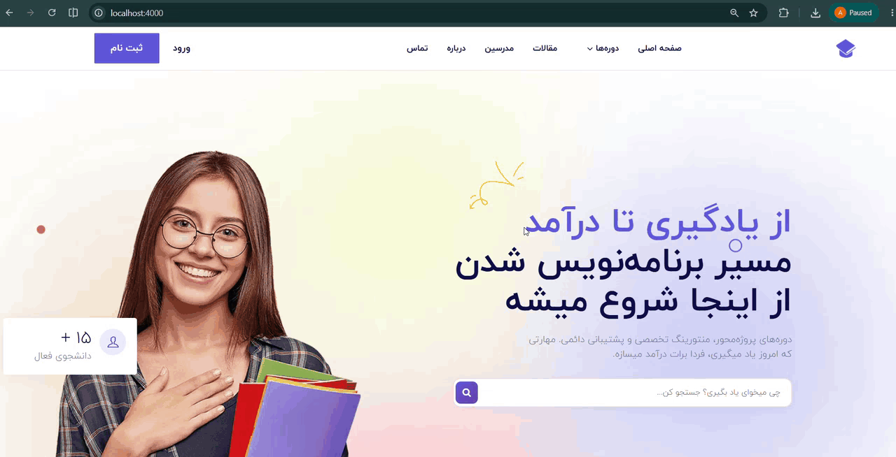
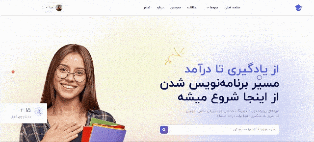
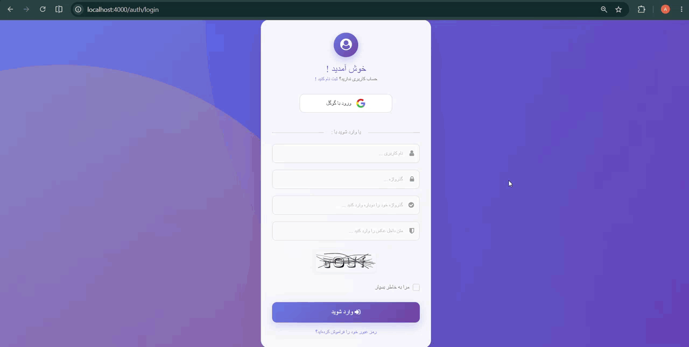
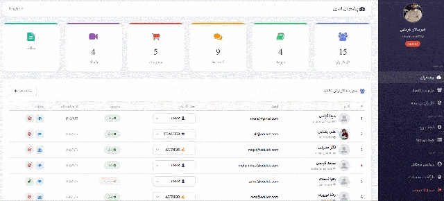
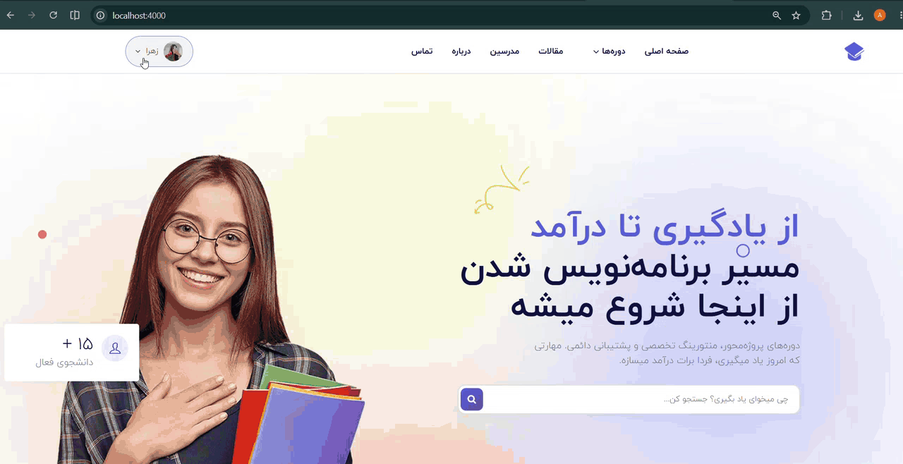

# 🎓 Mentora

<p align="center">
  
</p>

<p align="center">
  <b>پلتفرم جامع آموزش آنلاین</b><br>
  <i>A full-featured Learning Management System (LMS) built with Node.js, Express.js, MongoDB,and EJS following the MVC architecture.

Mentora provides a complete online learning platform where students can purchase courses, access lessons, read articles, communicate through tickets, and interact with educational content. The project focuses on implementing real-world backend concepts such as authentication, authorization, role-based access control, payment integration, and business logic.</i>
</p>

<p align="center">
  
  
  
  
  
</p>

---

## 📸 Screenshots

<div align="center">

| Home Page |
|:---:|

|  |

| Google OAuth |
|:---:|

|  |

| Course Details |
|:---:|

 |

| Payment + local login |
|:---:|

|  |

| Admin Dashboard |
|:---:|

|  |

| Author Dashboard |
|:---:|

|  |

</div>

---

## ✨ Features

### 🔐 Authentication & Authorization
- Role-Based Access Control (RBAC)
- Local Authentication (Register/Login)
- Google OAuth 2.0 Login
- JWT Authentication (Access Token & Refresh Token)
- Refresh Token stored securely in Redis
- Password hashing with bcryptjs
- CAPTCHA protection during login

### 👥 User Roles
- **ADMIN** — Full access
- **TEACHER** — Create sessions, manage own courses
- **AUTHOR** — Write and manage articles
- **SUPPORT** — Answer tickets
- **USER** — Purchase courses, leave reviews

### 📚 Course Management
- Create and manage courses
- Create course sessions with video upload
- Premium & free lesson support
- Student enrollment after successful payment
- Course access based on enrollment
- Student count for each course

### 🛒 Learning Experience
- Shopping Cart
- Zarinpal Payment Gateway
- Payment Verification
- Purchased course access
- Free lesson preview for guests

### 📝 Content Management
- Article Management (CRUD)
- Categories & Tags
- Author-based publishing
- Dynamic course rating from user reviews

### 💬 Comment System
- Add comments & replies
- Delete comments & replies
- Star rating system
- Nested replies

### 🎫 Ticket System
- User ticket management
- Admin/Support reply
- Automatic email notifications via Nodemailer

### 👤 User Profile
- Avatar upload
- Profile editing
- My Courses page

### 🔍 Search & Navigation
- Course search
- Category filtering
- Mega menu with categories
- Pagination

### ✅ Validation & Error Handling
- Request validation using Yup
- Global Error Handler
- SweetAlert2 error display

---

## 🛠️ Tech Stack

| Category | Technology |
|----------|------------|
| **Runtime** | Node.js 22.15.0 |
| **Framework** | Express.js 5.2.1 |
| **Database** | MongoDB 7.x + Mongoose 9.6.3 |
| **Cache** | Redis 7.x |
| **Auth** | Passport.js + JWT + Google OAuth 2.0 |
| **Security** | bcryptjs, Helmet |
| **Payment** | Zarinpal (Sandbox) |
| **Email** | Nodemailer + Gmail SMTP |
| **Validation** | Yup |
| **Upload** | Multer |
| **View Engine** | EJS |
| **Frontend** | Bootstrap 4, jQuery, SweetAlert2, Font Awesome |

---

## 📦 Packages

| Package | Version | Purpose |
|---------|---------|---------|
| express | ^5.2.1 | Web framework |
| mongoose | ^9.6.3 | MongoDB ODM |
| ejs | ^6.0.1 | Template engine |
| jsonwebtoken | ^9.0.3 | JWT auth |
| passport | ^0.7.0 | Auth middleware |
| passport-google-oauth20 | ^2.0.0 | Google OAuth |
| bcryptjs | ^3.0.3| Password hashing |
| multer | ^2.1.1 | File upload |
| nodemailer | ^6.9.7 | Email sending |
| helmet | ^7.1.0 | Security headers |
| redis | ^5.11.0 | Cache store |
| yup | ^1.7.1 | Input validation |
| sweetalert2 | ^11.10.0 | Alert dialogs |

---

## 📁 Project Structure


## Project Structure

```
Mentora
│
├── config
├── controllers
├── middlewares
├── models
├── routes
├── validators
├── utils
├── views
├── public
├── uploads
├── server.js
└── package.json
```

Following the MVC architecture for better maintainability and scalability.

---

## Backend Concepts Implemented

* MVC Architecture
* RESTful Routing
* Cookie-based Authentication
* Role-Based Access Control (RBAC)
* JWT Authentication
* Refresh Token Workflow
* Payment Integration
* File Upload
* Request Validation
* Error Handling
* Pagination
* Search & Filtering
* Business Logic Implementation

---

## Security

* Password hashing with bcrypt
* HTTP-only Cookies
* Google OAuth Authentication
* CAPTCHA Verification
* Request Validation using Yup
* Role-Based Authorization

---

## Future Improvements

* Docker Support
* Unit & Integration Testing
* API Documentation (Swagger)
* Rate Limiting
* Helmet
* Input Sanitization
* CI/CD Pipeline

---

## Installation

```bash
# 1. Clone
git clone https://github.com/YOUR_USERNAME/mentora.git
cd mentora

# 2. Install
npm install

# 3. Environment
cp .env.example .env
# Edit .env with your credentials

# 4. Seed database
npm run seed:all

# 5. Run
npm run dev

```
# Seeders
```
npm run seed:users       # Create test users
npm run seed:categories  # Create categories
npm run seed:courses     # Create courses
npm run seed:articles    # Create articles
npm run seed:sessions    # Create sessions
npm run seed:all         # Run all
```
Default password for all test users: 12345678


## Environment Variables

Create a `.env` file and configure the following:
```
# Application
PORT=4000

# Database
MONGO_URI=mongodb://127.0.0.1:27017/mentora

# JWT
JWT_SECRET=your_jwt_secret

ACCESS_TOKEN_SECRET_KEY=your_access_token_secret
REFRESH_TOKEN_SECRET_KEY=your_refresh_token_secret

ACCESS_TOKEN_EXPIRES_IN_SECONDS=3600
REFRESH_TOKEN_EXPIRES_IN_SECONDS=600000

# Google OAuth
GOOGLE_CLIENT_ID=your_google_client_id
GOOGLE_CLIENT_SECRET=your_google_client_secret

# Redis
REDIS_URI=redis://localhost:6379/

# ------------------------

# ZarinPal

ZARINPAL_PAYMENT_CALLBACK_URL=http://localhost:4000/checkout/verify
ZARINPAL_PAYMENT_API_BASE_URL=https://sandbox.zarinpal.com/pg/v4/payment/request.json
ZARINPAL_PAYMENT_VERIFY_URL=https://sandbox.zarinpal.com/pg/v4/payment/verify.json
ZARINPAL_PAYMENT_URL=https://sandbox.zarinpal.com/pg/StartPay/

ZARINPAL_MERCHANT_ID=your_zarinpal_merchant_id

# ------------------------
```
---

## License

This project was developed for educational purposes and portfolio demonstration.
<p align="center"> Built with ❤️ by AmirSalar Khormaie</p> 

